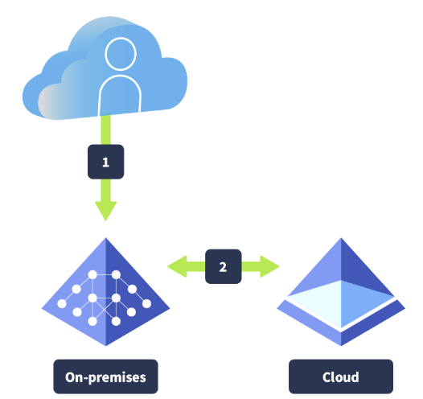
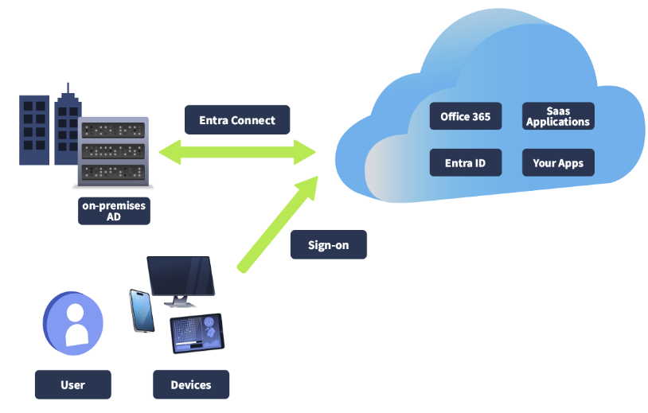
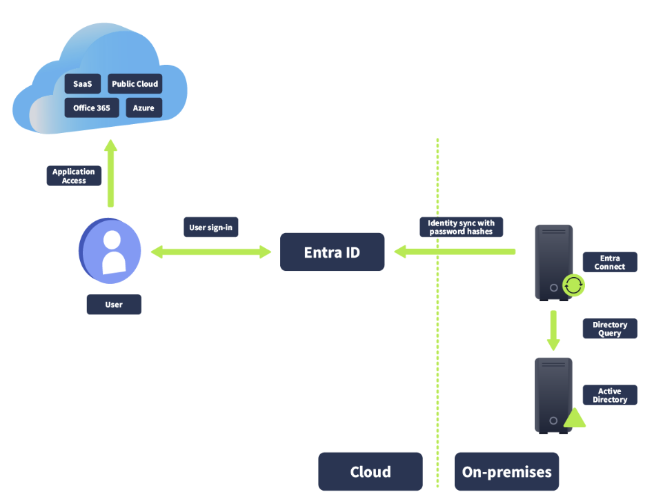
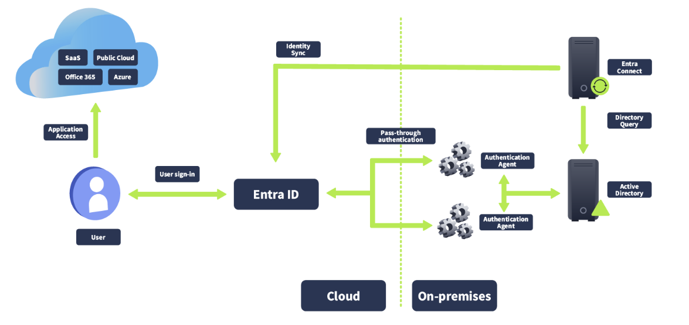
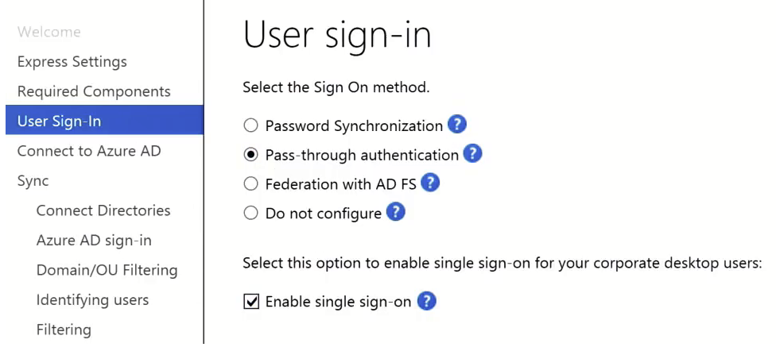
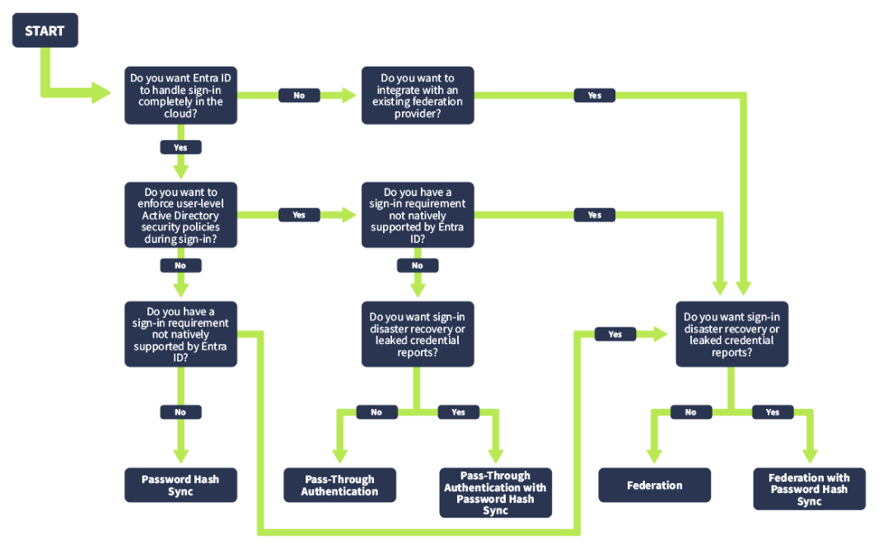

# MS Entra ID: Hybrid Identities

TryHackMe room covering the basics of **hybrid identity** and how Microsoft Entra ID connects with on-premises Active Directory.

This room was mainly conceptual and focused on understanding **Microsoft Entra Connect, synchronization, and hybrid sign-in methods** rather than building a full hybrid environment.

---

## Hybrid Identity Overview

Hybrid identity allows an organization to keep its existing on-premises Active Directory while also using Microsoft cloud services.

```text
On-Premises Active Directory
            ↕
     Microsoft Entra Connect
            ↕
      Microsoft Entra ID
            ↓
 Microsoft 365 / Azure / SaaS
```

The goal is to provide users with a consistent identity across both environments.



---

## Microsoft Entra Connect

**Microsoft Entra Connect** provides the connection between on-premises Active Directory and Microsoft Entra ID.

It can synchronize:

- users
- groups
- identity attributes
- account changes
- password-derived information



The room also introduced the difference between:

```text
Provisioning
= creating, updating, and removing identity objects

Synchronization
= keeping identity information consistent between systems
```

---

# Hybrid Sign-In Methods

The main authentication methods covered were:

- Password Hash Synchronization
- Pass-through Authentication
- Federation

## Password Hash Synchronization — PHS

With **PHS**, password-derived information is synchronized to Microsoft Entra ID and authentication is performed in the cloud.



```text
On-Prem AD
    ↓
Entra Connect
    ↓
Microsoft Entra ID
    ↓
Cloud authentication
```

Simple way to remember:

```text
PHS
= Entra authenticates
```

Main benefit: simpler architecture and lower dependency on on-premises infrastructure during cloud sign-in.

---

## Pass-through Authentication — PTA

With **PTA**, Microsoft Entra receives the login request but sends credential validation back to on-premises Active Directory through authentication agents.



```text
User
 ↓
Microsoft Entra ID
 ↓
PTA Agent
 ↓
Active Directory
```

Simple way to remember:

```text
PTA
= Entra asks on-prem AD
```

PTA keeps authentication connected to the local Active Directory environment, but it also creates additional infrastructure dependencies.

---

## Federation

With federation, Microsoft Entra trusts another identity provider to perform authentication.

A traditional example is **AD FS**.

```text
User
 ↓
Microsoft Entra ID
 ↓
Federation Provider
 ↓
Authentication
```

Simple way to remember:

```text
Federation
= Entra trusts another authentication system
```

Federation can support more specialized environments but adds additional infrastructure, certificates, trust relationships, and maintenance.

---

## Sign-In Options

Microsoft Entra Connect allows administrators to select the authentication model that best fits the organization.



| Method | Authentication Happens At | Complexity |
|---|---|---:|
| **PHS** | Microsoft Entra ID | Low |
| **PTA** | On-premises Active Directory | Medium |
| **Federation** | Trusted identity provider | High |

My memory model:

```text
PHS
→ Cloud authenticates

PTA
→ Cloud asks on-prem AD

Federation
→ Cloud trusts another IdP
```

---

## Authentication Decision Tree

The correct option depends on business and technical requirements.



Examples:

```text
Want cloud authentication?
→ PHS

Need on-prem AD validation?
→ PTA

Already use federation or special authentication?
→ Federation
```

The decision tree also showed that **Password Hash Synchronization can be useful as an additional recovery option** when PTA or Federation is used.

This was an important lesson: authentication design should consider both normal operation and what happens during an outage.

---

## Seamless SSO

**Seamless Single Sign-On** improves the user experience by reducing unnecessary login prompts.

It is not a replacement for PHS, PTA, or Federation.

```text
PHS / PTA / Federation
= how authentication happens

Seamless SSO
= how smoothly the user experiences sign-in
```

---

# Key Takeaways

- Hybrid identity connects on-premises Active Directory with Microsoft Entra ID.
- Microsoft Entra Connect synchronizes identity information between them.
- PHS performs authentication in Microsoft Entra ID.
- PTA validates credentials against on-premises Active Directory.
- Federation delegates authentication to another trusted identity provider.
- Seamless SSO improves the sign-in experience.
- The chosen authentication method affects complexity, resilience, and security.
- Hybrid identity infrastructure should be treated as security-sensitive.

---

# Skills Covered

- Microsoft Entra ID
- Hybrid identity
- Microsoft Entra Connect
- Active Directory integration
- Identity synchronization
- Password Hash Synchronization
- Pass-through Authentication
- Federation
- Seamless SSO
- Authentication architecture
